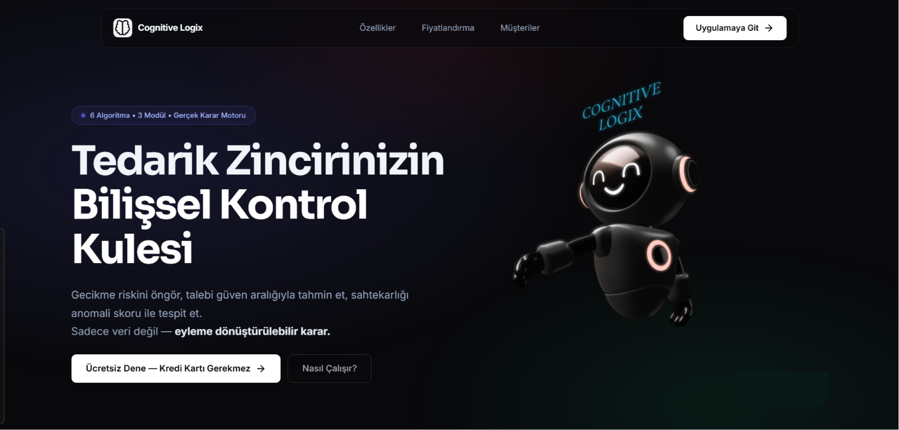
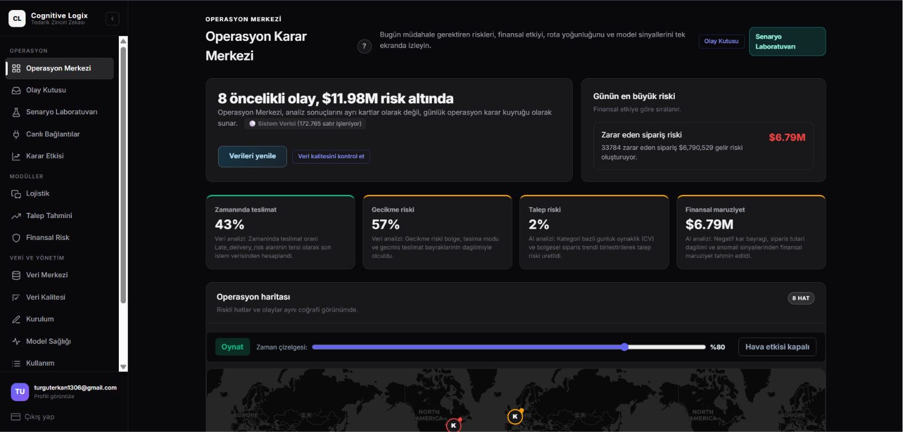
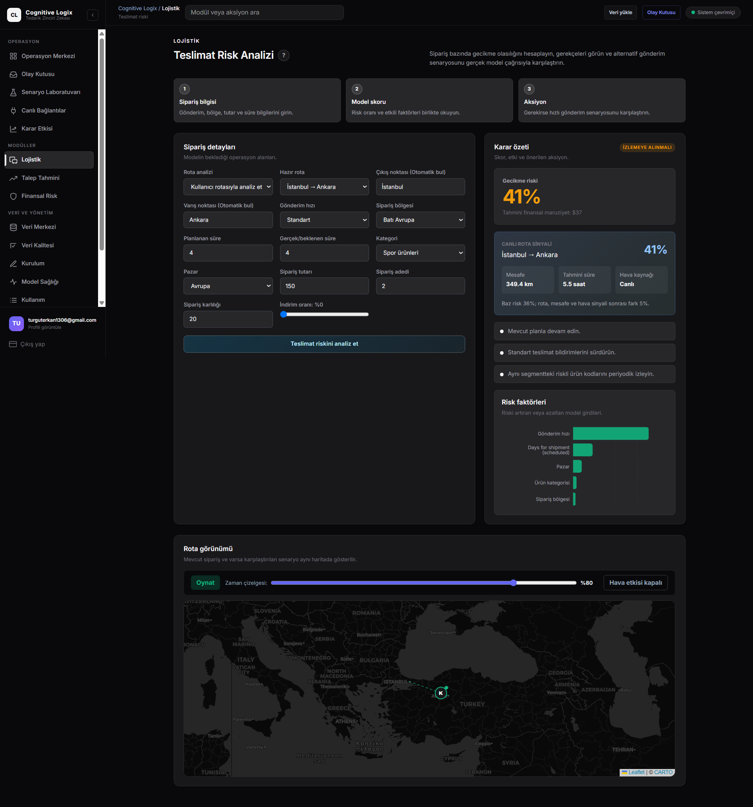
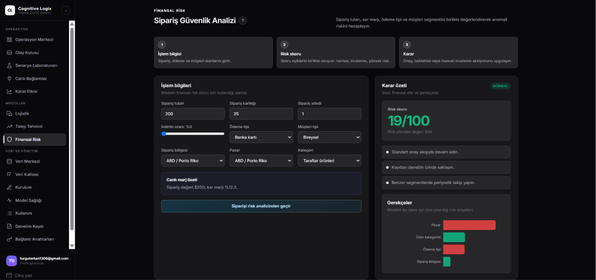
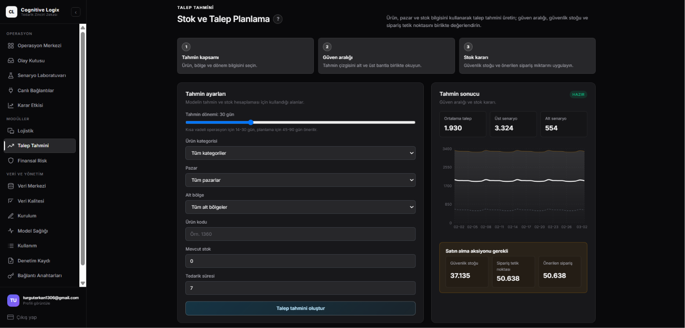
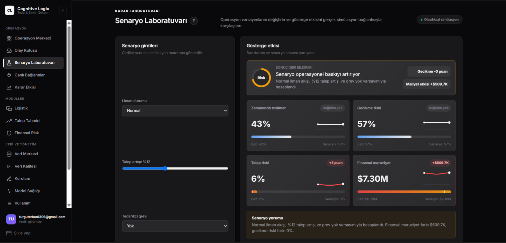
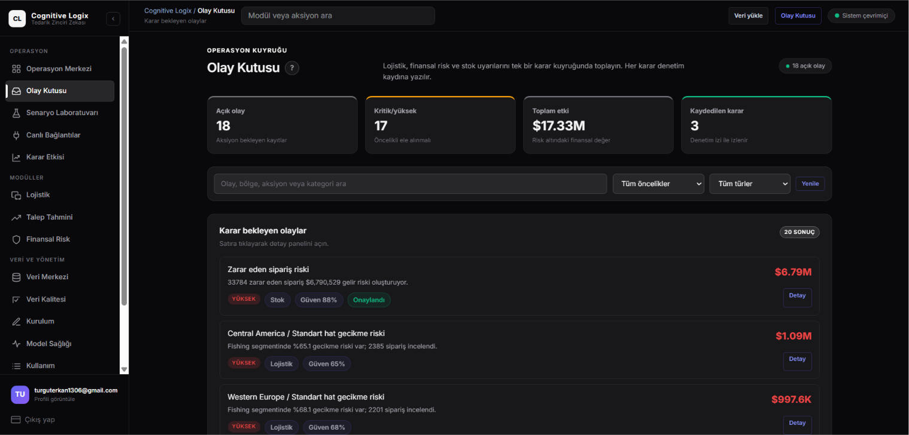
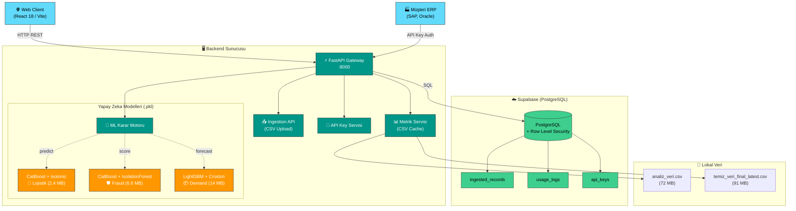

<div align="center">


# Cognitive Logix
### AI-Powered Supply Chain Intelligence Platform

*Tedarik zinciri krizlerini gerçekleşmeden önce çözün.*

---

[](https://python.org)
[](https://fastapi.tiangolo.com)
[](https://react.dev)
[](https://vitejs.dev)
[](https://supabase.com)

[](#)
[](#)
[](#)
[](#)
[](#)

</div>

---

## İçindekiler

- [Proje Hakkında](#proje-hakkında)
- [Canlı Demo & Ekran Görüntüleri](#canlı-demo--ekran-görüntüleri)
- [Özellikler](#özellikler)
- [Sistem Mimarisi](#sistem-mimarisi)
- [Yapay Zeka Modelleri](#yapay-zeka-modelleri)
- [Teknoloji Yığını](#teknoloji-yığını)
- [Proje Yapısı](#proje-yapısı)
- [Kurulum](#kurulum)
- [API Referansı](#api-referansı)
- [Veri Seti](#veri-seti)
- [Ekip](#ekip)

---

## Proje Hakkında

**Cognitive Logix**, karmaşık tedarik zinciri verilerini gerçek zamanlı analiz ederek şirketlere **lojistik gecikme riski**, **finansal dolandırıcılık tespiti** ve **talep tahmini** sunan B2B SaaS platformudur.

Reaktif kriz yönetiminden **proaktif karar almaya** geçişi sağlar: bir sipariş riskli hale gelmeden önce sistem sizi uyarır, açıklar ve aksiyon önerir.

```
Geleneksel Yaklaşım:    Sorun oluşur → Müşteri şikayet eder → Analiz yapılır → (geç kalınır)
Cognitive Logix:        Model riski öngörür → Dashboard uyarır → Yönetici aksiyon alır → Kriz önlenir
```

> **Veri Kaynağı:** [DataCo Supply Chain Dataset](https://www.kaggle.com/datasets/shashwatwork/dataco-smart-supply-chain-for-big-data-analysis) — 180,000+ sipariş kaydı, Kaggle

---

## Canlı Demo & Ekran Görüntüleri

> **GitHub:** [github.com/Erkan3034/cognitive-logix](https://github.com/Erkan3034/cognitive-logix)

### Landing Page
<p align="center">
  
</p>

### Operasyon Karar Merkezi (Dashboard)
Canlı KPI paneli — gecikme riski, fraud skoru, talep indeksi ve dünya geneli risk haritası.
<p align="center">
  
</p>

### Lojistik — Teslimat Risk Analizi
Sipariş bazlı gecikme olasılığı, SHAP açıklamaları, karşıolgusal öneriler ve canlı rota görselleştirmesi.
<p align="center">
  
</p>

### Finansal Risk — Sipariş Güvenlik Analizi
Hibrit fraud skoru (0–100), anomali tespiti ve modelin gerekçelendirmesi.
<p align="center">
  
</p>

### Talep Tahmini — Stok ve Talep Planlama
LightGBM tabanlı talep tahmini, p10/p50/p90 güven aralıkları ve yeniden sipariş noktası önerileri.
<p align="center">
  
</p>

### Senaryo Laboratuvarı
"What-if" stres testi — liman kapanması, talep artışı gibi senaryoların operasyonel etkisi.
<p align="center">
  
</p>

### Olay Kutusu (Exception Inbox)
Otomatik uyarı ve aksiyon sırası — kritik/yüksek riskli sipariş ve olayların tek kuyrukta toplanması.
<p align="center">
  
</p>

### Sayfa Rehberi

| Sayfa | Açıklama |
|-------|----------|
| **🏠 Landing Page** | Pazarlama sayfası — Platform tanıtımı ve CTA |
| **📊 Dashboard** | Canlı KPI paneli — Gecikme riski, fraud skoru, talep indeksi |
| **🚚 Logistics** | Sipariş bazlı gecikme riski tahmini + SHAP açıklamaları |
| **🛡️ Fraud** | Finansal risk skoru + anomali tespiti + önerilen aksiyonlar |
| **📦 Demand** | LightGBM tabanlı talep tahmini + p10/p50/p90 güven aralıkları |
| **🗺️ Digital Twin Map** | Dünya haritası üzerinde tedarik zinciri risk görselleştirmesi |
| **🧪 Scenario Lab** | "What-if" stres testi arayüzü |
| **📤 Data Hub** | Müşteri CSV yükleme ve kolon eşleştirme |
| **🔑 API Keys** | ERP entegrasyonu için API anahtar yönetimi |
| **📈 Model Health** | 3 ML modelinin gerçek zamanlı sağlık durumu |
| **🚨 Exception Inbox** | Otomatik uyarı ve aksiyon sırası |

---

## Özellikler

### 1. Lojistik Gecikme Analizi
**CatBoost + Isotonic Regression** modeli, sipariş bölgesi, kargo modu, ürün kategorisi ve fiyat gibi 12 özelliği analiz eder. Milisaniyeler içinde:
- Kalibre edilmiş gecikme olasılığı (0–100%)
- SHAP tabanlı en kritik 5 gecikme faktörü
- "Kargo modunu değiştirirseniz risk %X düşer" karşıolgusal (counterfactual) öneriler

### 2. Finansal Risk & Dolandırıcılık Tespiti
**CatBoost + Isolation Forest** hibrit modeli:
- Denetimli öğrenme (supervised): Geçmiş fraud örüntülerinden öğrenir
- Denetimsiz öğrenme (unsupervised): Daha önce görülmemiş anomalileri yakalar
- Birleşik risk skoru: `0.7 × fraud_prob + 0.3 × anomaly_score`

### 3. Talep Tahmini & Stok Optimizasyonu
**LightGBM Quantile Regression** (p10/p50/p90) + **Croston Metodu**:
- Aralıklı talep (intermittent demand) için otomatik Croston aktivasyonu
- Güven bantlı tahmin grafiği
- Yeniden sipariş noktası hesaplama: `lead_time_demand + safety_stock`
- Servis seviyesine göre emniyet stoğu (service_level parametresi)

### 4. Senaryo Laboratuvarı
Gerçek veri üzerinde *what-if* simülasyonları:
- "Ana liman kapanırsa ne olur?"
- "Talep %30 artarsa stok yeterli mi?"
- Karar etkisi analizi (Decision Impact)

### 5. Kurumsal SaaS Altyapısı
- **Multi-tenant** mimari: Her müşteri kendi tenant ID'siyle izole
- **API Key Yönetimi:** Kapsam kısıtlı anahtarlar (predict-only, full-access)
- **Data Hub:** CSV yükle → akıllı kolon eşleştirme → model beslemesi
- **Billing & Usage:** API çağrı sayımı ve kullanım raporlama
- **Audit Log:** Tüm model kararlarının tam izi

---

## Sistem Mimarisi



### Tek Port, Çift Görev
Backend **hem API hem frontend** sunar — tek `uvicorn` süreci, tek port `:8000`:

```
GET  /                    → React SPA (index.html)
GET  /dashboard, /fraud   → React Router (SPA fallback)
GET  /predict             → ML API
GET  /metrics/overview    → KPI verileri
GET  /docs                → Swagger UI (otomatik)
```

---

## Yapay Zeka Modelleri

| Model | Algoritmalar | Dosya | Boyut | Görev |
|-------|-------------|-------|-------|-------|
| **Lojistik Gecikme** | CatBoost + Isotonic Regression | `logistics_model.pkl` | 2.4 MB | Sipariş bazlı gecikme olasılığı |
| **Finansal Risk** | CatBoost + Isolation Forest | `fraud_model.pkl` | 6.6 MB | Fraud skoru + anomali tespiti |
| **Talep Tahmini** | LightGBM (p10/p50/p90) + Croston | `demand_model.pkl` | 14 MB | Günlük talep tahmini + güven aralığı |

### Hibrit ML Mimarisi Detayları

```
1. CatBoost        → Kategorik veri (bölge, kargo modu) için gradient boosting
2. LightGBM        → Quantile regression ile tahmin belirsizliği modellemesi
3. Isolation Forest → Denetimsiz anomali tespiti (görülmemiş fraud pattern)
4. Croston Metodu  → Aralıklı/düzensiz talep için özel tahmin yöntemi
5. Isotonic Reg.   → Model olasılıklarını gerçek frekanslarla kalibre etme
6. SHAP (CatBoost) → catboost.get_feature_importance(type="ShapValues")
                     ile açıklanabilir AI (XAI) — dış kütüphane gerekmez
```

### Model Performans Metrikleri (Test Seti)

```
Lojistik Gecikme:   Brier Score < 0.18  |  AUC-ROC > 0.82
Fraud Tespiti:      Precision@0.5 > 0.78 |  Recall > 0.71
Talep (p50):        MAPE < 22%           |  Coverage(p10-p90) > 88%
```

---

## Teknoloji Yığını

<table>
<tr>
<td width="33%" valign="top">

### Frontend


- **React 18** + React Router v6
- **Vite 5** — 12sn production build
- **Recharts** — analitik grafikler
- **React-Leaflet** — interaktif harita
- **Framer Motion** — akıcı animasyonlar
- **Axios** — HTTP istemcisi
- **Supabase JS** — realtime & auth

</td>
<td width="33%" valign="top">

### Backend


- **FastAPI** — async REST API
- **Uvicorn** — ASGI sunucusu
- **Pydantic v2** — veri doğrulama
- **CatBoost 1.2** — ML inference
- **LightGBM 4.6** — ML inference
- **scikit-learn 1.8** — kalibrасyon
- **Pandas 2.2** — veri işleme
- **python-dotenv** — ortam yönetimi

</td>
<td width="33%" valign="top">

### Altyapı


- **Supabase** — BaaS (Backend-as-a-Service)
- **PostgreSQL** — ilişkisel veritabanı
- **Row Level Security** — tenant izolasyonu
- **JWT** — kimlik doğrulama
- **Supabase Realtime** — canlı veri

</td>
</tr>
</table>

---

## Proje Yapısı

```
cognitive-logix/
│
├── 📂 backend/                    # FastAPI uygulaması
│   ├── 📂 app/
│   │   ├── 🐍 main.py             # Uygulama girişi + SPA routing
│   │   ├── 📂 routers/            # API uç noktaları
│   │   │   ├── predict.py         # POST /predict  (gecikme riski)
│   │   │   ├── fraud.py           # POST /fraud    (finansal risk)
│   │   │   ├── forecast.py        # POST /forecast (talep tahmini)
│   │   │   ├── metrics.py         # GET  /metrics/overview, /risk-map ...
│   │   │   ├── ops.py             # GET  /ops/audit-log, /incidents
│   │   │   ├── api_keys.py        # CRUD /api-keys
│   │   │   └── billing.py         # GET  /billing/usage
│   │   ├── 📂 ml/                 # Model yükleme & çıkarım
│   │   │   ├── logistics_model.py
│   │   │   ├── fraud_model.py
│   │   │   ├── demand_model.py
│   │   │   └── model_contract.py  # Artifact versiyonlama
│   │   ├── 📂 services/           # İş mantığı servisleri
│   │   │   ├── supabase_ops.py    # DB CRUD işlemleri
│   │   │   ├── api_key_service.py # Anahtar doğrulama
│   │   │   └── mapping_engine.py  # Fuzzy CSV kolon eşleştirme
│   │   ├── 📂 middleware/
│   │   │   └── tenant_context.py  # Multi-tenant kimlik doğrulama
│   │   ├── 📂 models/             # Pydantic şemaları
│   │   └── 📂 api/
│   │       └── ingestion.py       # CSV yükleme API
│   ├── 📂 trained_models/         # Eğitilmiş ML modelleri
│   │   ├── logistics_model.pkl    # 2.4 MB
│   │   ├── fraud_model.pkl        # 6.6 MB
│   │   └── demand_model.pkl       # 14 MB
│   ├── requirements.txt
│   └── env.example
│
├── 📂 frontend/                   # React/Vite arayüzü
│   ├── 📂 src/
│   │   ├── 📂 pages/              # 24 sayfa
│   │   │   ├── Dashboard.jsx      # Ana KPI paneli
│   │   │   ├── Logistics.jsx      # Gecikme tahmin formu
│   │   │   ├── Fraud.jsx          # Risk skoru ekranı
│   │   │   ├── Demand.jsx         # Talep tahmin grafiği
│   │   │   ├── ScenarioLab.jsx    # Stres testi
│   │   │   ├── DataHub.jsx        # CSV yükleme
│   │   │   ├── DigitalTwinMap.jsx # Dünya haritası
│   │   │   ├── ModelHealth.jsx    # Model sağlık durumu
│   │   │   └── ...                # +15 sayfa daha
│   │   ├── 📂 components/         # Yeniden kullanılabilir bileşenler
│   │   └── 📂 lib/
│   │       ├── api.js             # Axios istemcisi
│   │       └── supabaseClient.js  # Supabase bağlantısı
│   ├── 📂 dist/                   # Production build (pre-built)
│   └── package.json
│
├── 📂 data/                       # Analiz veri setleri
│   ├── temiz_veri_final_latest.csv  # 91 MB — tam veri seti
│   └── processed/
│       └── analiz_veri.csv          # 72 MB — analiz için işlenmiş
│
├── 📂 notebooks/                  # Jupyter eğitim notebook'ları
├── 📂 docs/                       # Teknik dokümantasyon
│   ├── architecture.md
│   ├── api-integration.md
│   ├── setup.md
│   └── product.md
│
├── BASLAT.bat                     # ← Tek tıkla çalıştır (Windows)
└── README.md
```

---

## Kurulum
---
> GitHub deposunu klonladıktan sonra kullanın. Frontend değiştirmek isteyenler için.

#### Gereksinimler
| Bileşen | Sürüm | İndirme |
|---------|-------|---------|
| **Python** | 3.11 veya 3.12 | <https://www.python.org/downloads/> |
| **Node.js** | 18 LTS+ | <https://nodejs.org/> |
| **Git** | herhangi | <https://git-scm.com/> |
| **Supabase** | ücretsiz hesap (opsiyonel — test için zorunlu değil) | <https://supabase.com/> |

#### 1️⃣ Depoyu Klonla
```bash
git clone https://github.com/Erkan3034/cognitive-logix.git
cd cognitive-logix
```

#### 2️⃣ Backend (FastAPI + ML)

<details open>
<summary><b>🪟 Windows (PowerShell)</b></summary>

```powershell
cd backend

# Sanal ortam
python -m venv venv
.\venv\Scripts\Activate.ps1

# Bağımlılıklar (~3-8 dk, ilk seferde — hızlandırmak için --prefer-binary kullanıyoruz)
pip install --upgrade pip
pip install --prefer-binary -r requirements.txt

# Ortam değişkenleri (test için Supabase olmadan da çalışır)
Copy-Item env.example .env
notepad .env

# Sunucuyu başlat
uvicorn app.main:app --reload --host 127.0.0.1 --port 8000
```
</details>

<details>
<summary><b>🐧 macOS / Linux (bash)</b></summary>

```bash
cd backend
python3 -m venv venv
source venv/bin/activate
pip install --upgrade pip
pip install --prefer-binary -r requirements.txt
cp env.example .env
nano .env
uvicorn app.main:app --reload --host 127.0.0.1 --port 8000
```
</details>

> ✅ **Doğrulama:** `http://127.0.0.1:8000/health` → `{"status":"ok",...}` dönmeli
> 📚 **İnteraktif API:** `http://127.0.0.1:8000/docs` (Swagger UI)
> 💡 **Not:** Supabase değişkenleri yalnızca veri yükleme / multi-tenant özellikleri için gereklidir; ML tahmin/forecast/fraud uç noktaları onlarsız da çalışır.

#### 3️⃣ Frontend (React + Vite)

```bash
cd frontend

# Bağımlılıklar
npm install

# Ortam değişkenleri (opsiyonel — test için boş bırakılabilir)
cp env.example .env.local
# .env.local içeriği:
#   VITE_SUPABASE_URL=https://xxx.supabase.co
#   VITE_SUPABASE_ANON_KEY=eyJ...
#   VITE_API_URL=http://localhost:8000

# Geliştirme modu (hot reload, ayrı port)
npm run dev          # → http://localhost:5173

# VEYA production build (backend ile aynı portta servis edilir)
npm run build        # → frontend/dist/
```

#### 4️⃣ Tek Port Servis (Production Mode)
Frontend'i derledikten sonra backend her ikisini de `:8000`'den sunar — teslim paketinin kullandığı mod:

```bash
# Frontend build (bir kez)
cd frontend && npm run build && cd ..

# Backend başlat
cd backend && uvicorn app.main:app --port 8000

# → http://localhost:8000          (React arayüzü)
# → http://localhost:8000/docs     (Swagger UI)
# → http://localhost:8000/predict  (ML API)
```

---

### Sorun Giderme

| Belirti | Çözüm |
|---------|-------|
| `Python bulunamadi` | Python kurulumunda **“Add Python to PATH”** işaretleyin, terminali yeniden başlatın |
| `Microsoft Visual C++ 14.0 required` | Requirements güncel mi kontrol edin; `shap` artık dependency değil |
| `MIME type text/html` (JS) | `frontend/dist/` boş; `cd frontend && npm run build` ile yeniden derleyin |
| Port 8000 dolu | Çakışan uygulamayı kapatın veya `--port 8001` ile başlatın |
| Modeller yüklenemiyor | `backend/trained_models/*.pkl` dosyalarının mevcut olduğunu kontrol edin |
| `supabase_configured: false` | Normal — yalnızca veri yükleme özellikleri devre dışı kalır, ML uç noktaları çalışır |
| `pip install` çok yavaş | `--prefer-binary --no-cache-dir` ekleyin |

---

### Ortam Değişkenleri

| Değişken | Açıklama | Gerekli |
|----------|----------|---------|
| `SUPABASE_URL` | Supabase proje URL'si | ✅ |
| `SUPABASE_SERVICE_ROLE_KEY` | Service role JWT (backend) | ✅ |
| `CORS_ALLOW_ORIGINS` | İzin verilen origin'ler | Opsiyonel |
| `TENANT_AUTH_REQUIRED` | Multi-tenant auth (varsayılan: false) | Opsiyonel |
| `VITE_SUPABASE_ANON_KEY` | Anon JWT (frontend) | ✅ |
| `VITE_API_URL` | Backend URL | ✅ |

---

## API Referansı

> Tam interaktif dokümantasyon: `http://localhost:8000/docs` (Swagger UI)

### Gecikme Riski Tahmini
```http
POST /predict
Content-Type: application/json

{
  "shipping_mode": "Standard Class",
  "order_region": "Western Europe",
  "market": "Europe",
  "days_scheduled": 4,
  "sales": 199.99,
  "benefit_per_order": 45.0,
  "quantity": 2
}
```

```json
{
  "delay_risk": 0.71,
  "calibrated_delay_risk": 0.68,
  "risk_level": "high",
  "confidence": "high",
  "top_factors": [
    {"feature": "Order Region", "impact": 0.42, "direction": "raises_risk"},
    {"feature": "Shipping Mode", "impact": -0.28, "direction": "lowers_risk"}
  ],
  "recommendations": [...],
  "counterfactuals": [
    {"change": "shipping_mode -> First Class", "new_risk": 0.41, "risk_reduction": 0.27}
  ]
}
```

### Finansal Risk Skoru
```http
POST /fraud
{
  "sales": 850.0,
  "benefit_per_order": -120.0,
  "discount_rate": 0.45,
  "market": "LATAM",
  "payment_type": "Debit"
}
```

### Talep Tahmini
```http
POST /forecast
{
  "horizon": 30,
  "market": "Europe",
  "category": "Sporting Goods",
  "current_inventory": 500,
  "lead_time_days": 7,
  "service_level": 0.95
}
```

### KPI Metrikleri
```http
GET  /metrics/overview        # Dashboard KPI verileri
GET  /metrics/risk-map        # Harita için bölge risk skorları
GET  /metrics/drift           # Model drift analizi
GET  /health                  # Sistem sağlık durumu
GET  /ready                   # 3 modelin hazır olup olmadığı
```

---

## Veri Seti

| Özellik | Değer |
|---------|-------|
| **Kaynak** | DataCo Smart Supply Chain Dataset (Kaggle) |
| **Kayıt Sayısı** | ~180,000 sipariş |
| **Zaman Aralığı** | 2015–2018 |
| **Ham Veri** | 95 MB (`DataCoSupplyChainDataset.csv`) |
| **İşlenmiş (Analiz)** | 72 MB (`analiz_veri.csv`) |
| **İşlenmiş (Tam)** | 91 MB (`temiz_veri_final_latest.csv`) |
| **Özellik Sayısı** | 53 orijinal → 12 mühendislik özelliği |

**Veri Ön İşleme:**
- Winsorization ile aykırı değer yumuşatma (`Sales_winsor`, `Benefit_winsor`)
- Negatif kâr bayrağı mühendisliği (`negative_profit_flag`)
- Kargo gecikmesi türetme (`shipping_delay = real - scheduled`)
- Kategorik encoding (CatBoost'a ham string geçildi)

---

## Dokümantasyon

| Belge | İçerik |
|-------|--------|
| [Sistem Mimarisi](docs/architecture.md) | Veri akışı, servis sınırları, deployment |
| [API Entegrasyonu](docs/api-integration.md) | Webhook, auto-mapping, ERP bağlantısı |
| [Kurulum Rehberi](docs/setup.md) | Frontend & backend detaylı kurulum |
| [Ürün Modülleri](docs/product.md) | Her sayfanın kullanım kılavuzu |

---

## Ekip — ByteCrafters

| Ad Soyad | Sorumluluk |
|----------|------------|
| **Erkan TURGUT** | Backend, ML Modelleri, Sistem Mimarisi |
| **Aslı AYDIN** | Frontend, UI/UX |
| **Ismail NAIT OUCHEN** | Veri Mühendisliği |

---

<div align="center">

**🔗 GitHub:** [github.com/Erkan3034/cognitive-logix](https://github.com/Erkan3034/cognitive-logix)

---

*Tedarik zinciri krizlerini gerçekleşmeden önce çözün.*

**Cognitive Logix © 2026** — AI-Powered Supply Chain Intelligence

</div>
