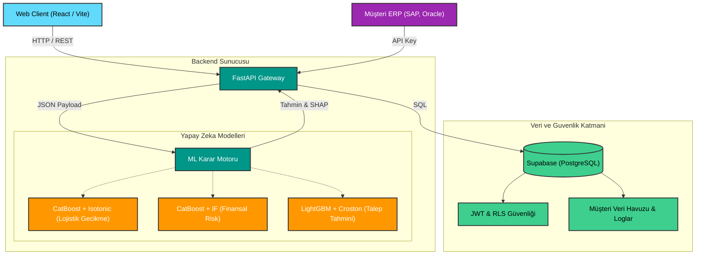

<div align="center">
  
# 🧠 Cognitive Logix

**Yapay Zeka Destekli Tedarik Zinciri Dijital İkizi (AI-Powered Supply Chain Digital Twin)**

[](#)
[](#)
[](#)
[](#)
[](#)

> **Cognitive Logix**, karmaşık tedarik zinciri verilerini analiz ederek şirketlere anlık finansal risk, lojistik gecikme ve talep tahminlemesi sunan B2B SaaS (Software as a Service) platformudur. Büyük veri setlerinden öğrenen makine öğrenmesi modelleri sayesinde reaktif kriz yönetiminden, proaktif karar alma sürecine geçişi sağlar.

---
</div>

## 📚 Dokümantasyon
Projenin detaylı teknik altyapısını ve kullanım kılavuzlarını aşağıdaki belgelerden inceleyebilirsiniz:
- [Sistem Mimarisi ve Veri Akışı](docs/architecture.md)
- [API Entegrasyon Rehberi (Webhook & Auto-Mapping)](docs/api-integration.md)
- [Geliştirici Kurulum Rehberi (Frontend & Backend)](docs/setup.md)
- [Ürün Modülleri El Kitabı](docs/product.md)

## ✨ Öne Çıkan Özellikler

### 🚚 1. Lojistik Gecikme Analizi
Geçmiş sipariş rotalarını ve hava durumu/taşıyıcı performanslarını analiz eden **XGBoost modeli**, siparişin zamanında ulaşıp ulaşmayacağını milisaniyeler içinde tahmin eder. Karar sadece bir skor değil; gecikmeye neden olan faktörlerin (Feature Importance) dökümünü de sağlar.

### 🛡️ 2. Finansal Risk ve Dolandırıcılık Tespiti (Fraud)
İşlem tutarı, kâr marjı, ödeme tipi ve coğrafi bölge verilerini anomali tespit motorundan geçirir. Şüpheli siparişleri sevkiyata çıkmadan önce durdurarak doğrudan ERP/Sipariş Yönetimi sistemine "Hold" (Beklet) sinyali gönderir.

### 📦 3. Talep Tahmini ve Stok Yönetimi
Satış geçmişine dayanarak gelecekteki stok ihtiyaçlarını hesaplar. Beklenen tahmini, **güven aralıklarıyla (alt ve üst limit)** grafiksel olarak sunarak aşırı stoklama (overstocking) veya stok tükenmesi (stockout) maliyetlerini minimuma indirir.

### 🧪 4. Senaryo Laboratuvarı (Stres Testi)
Tedarik zinciri yöneticilerinin *"Ana liman kapanırsa veya talep %30 artarsa ne olur?"* gibi kriz senaryolarını canlı veri üzerinde test etmelerini sağlar. Model, bu varsayımsal durumların finansal etkisini ve gecikme riskindeki artışı anında simüle eder.

### 🏢 5. Kurumsal SaaS Altyapısı
- **Veri Merkezi (Data Hub):** Şirketlerin kendi geçmiş verilerini (CSV/Excel) yükleyip, sistemin veri sözlüğüne (mapping) bağlayabilecekleri entegrasyon alanı.
- **API Anahtarları (API Keys):** Şirketlerin mevcut ERP ve e-ticaret altyapılarını Cognitive Logix'e bağlaması için güvenlik kapsamları daraltılmış anahtar yönetimi.

## Sistem Mimarisi

Aşağıdaki şema, sistemin uçtan uca veri akışını ve yapay zeka katmanlarının nasıl entegre çalıştığını göstermektedir:



## 🏗️ Teknoloji Yığını (Tech Stack)

<table>
  <tr>
    <td align="center" width="33%">
      <h3>Frontend (Client)</h3>
      
      <br/><br/>
      <ul>
        <li><b>React.js (Vite):</b> Modüler arayüz</li>
        <li><b>Framer Motion:</b> Akıcı animasyonlar</li>
        <li><b>Vanilla CSS:</b> Özel "Enterprise Dark" UI</li>
        <li><b>Recharts:</b> Analitik grafikler</li>
      </ul>
    </td>
    <td align="center" width="33%">
      <h3>Backend (API & ML)</h3>
      
      <br/><br/>
      <ul>
        <li><b>FastAPI:</b> Asenkron API sunucusu</li>
        <li><b>CatBoost/LightGBM:</b> Eğitilmiş `.pkl` modelleri</li>
        <li><b>Pandas:</b> Özellik mühendisliği</li>
        <li><b>Pydantic:</b> Veri doğrulama</li>
      </ul>
    </td>
    <td align="center" width="33%">
      <h3>Database & Auth</h3>
      
      <br/><br/>
      <ul>
        <li><b>Supabase:</b> BaaS Altyapısı</li>
        <li><b>PostgreSQL:</b> İlişkisel veritabanı</li>
        <li><b>RLS:</b> Satır bazlı güvenlik</li>
        <li><b>JWT:</b> Güvenli kimlik doğrulama</li>
      </ul>
    </td>
  </tr>
</table>

## 🚀 Kurulum ve Geliştirme Ortamı

Projeyi yerel ortamınızda (localhost) çalıştırmak için aşağıdaki adımları izleyin.

### 1. Gereksinimler
- Node.js (v18+)
- Python (v3.9+)
- Bir Supabase projesi (API URL ve Anon Key)

### 2. Backend (FastAPI) Kurulumu
Backend, makine öğrenmesi modellerini barındırır ve API uç noktalarını sağlar.

```bash
cd backend
python -m venv venv

# Windows için:
venv\Scripts\activate
# Mac/Linux için:
# source venv/bin/activate

pip install -r requirements.txt
uvicorn app.main:app --reload
```
> 💡 API varsayılan olarak `http://localhost:8000` adresinde ayağa kalkacaktır. Otomatik dökümantasyon (Swagger UI) için `http://localhost:8000/docs` adresini ziyaret edebilirsiniz.

### 3. Frontend (React) Kurulumu
Frontend, "Control Tower" (Kontrol Kulesi) arayüzünü barındırır.

```bash
cd frontend
npm install

# Ortam değişkenlerini ayarlayın
# .env dosyası oluşturup VITE_SUPABASE_URL ve VITE_SUPABASE_ANON_KEY ekleyin

npm run dev
```
> 💡 Uygulama `http://localhost:5173` adresinde çalışacaktır.

## 📦 Öğretmen için Tek Tıkla Çalıştırma

Bu repo, zip olarak paylaşılacak sürüm için de hazırlanmıştır:
- `build-teacher-package.ps1` ile `teacher_package\` klasörü ve `teacher_package.zip` üretilebilir.
- `run-teacher-package.bat` zip içinden çift tıkla backend'i başlatır ve tarayıcıda projeyi açar.
- Paket içinde `backend\trained_models\*.pkl`, `backend\.env`, `frontend\dist\` ve `data\` klasörleri bulunmalıdır.

## 🧠 Yapay Zeka Modelleri ve Algoritmalar

Projedeki analitik yetenekler, *DataCo Supply Chain* veri seti üzerinde özel olarak eğitilmiş makine öğrenmesi modelleriyle desteklenmektedir:

## 🧠 Yapay Zeka Modelleri ve Algoritmalar (AI Decision Engine)

Projede, sadece standart tahminleme değil, aynı zamanda anomali tespiti, kalibrasyon ve karar açıklanabilirliği sağlamak için **6 farklı algoritmadan oluşan hibrit bir makine öğrenmesi mimarisi** kullanılmıştır:

1. **CatBoost (Categorical Boosting):** Tedarik zincirindeki kategorik verileri (bölge, kargo modu vb.) çok hızlı işleyebildiği için hem *Lojistik Gecikme Modeli* hem de *Finansal Risk Modeli* için süpervizörlü (supervised) ana karar motoru olarak kullanılmıştır.
2. **LightGBM (LGBMRegressor):** Talep (Demand) tahminlemesinde yüksek hız ve **Quantile Regression** (p10, p50, p90 güven aralıkları) sağlayarak "En kötü ve en iyi ihtimal" stok eşiklerini hesaplamak için kullanılmıştır.
3. **Isolation Forest (İzolasyon Ormanı):** Sahtekarlık (Fraud) modülünde CatBoost'a destek olarak çalışan denetimsiz (unsupervised) bir algoritmadır. Sistemin daha önce hiç görmediği, yepyeni dolandırıcılık anomalilerini (outliers) yakalar.
4. **Croston Metodu:** Talep tahmininde çok kritik bir mühendislik adımıdır. Her gün düzenli satılmayan (aralıklı/intermittent) ürünler için LightGBM devredışı kalır ve sistem otomatik olarak pürüzlü talepleri (lumpy demand) hesaplayan Croston yöntemine geçer.
5. **Isotonic Regression:** Ağaç tabanlı modellerin ürettiği ham sonuçları, gerçek dünya olasılıklarına (Probability Calibration) dönüştürür. Sistemin "%85 Risk" çıktısının matematiksel olarak doğru kalibre edilmesini sağlar.
6. **SHAP (SHapley Additive exPlanations):** Açıklanabilir Yapay Zeka (XAI) katmanıdır. Karar motoru bir siparişi riskli bulduğunda (inference zamanında), kullanıcılara "Bu sipariş neden riskli?" sorusunun cevabını (Feature Importance) verebilmek için kullanılmıştır.

---
<div align="center">
  <i>Tedarik zinciri krizlerini gerçekleşmeden önce çözün.</i><br/>
  <b>Cognitive Logix © 2026</b>
</div>
