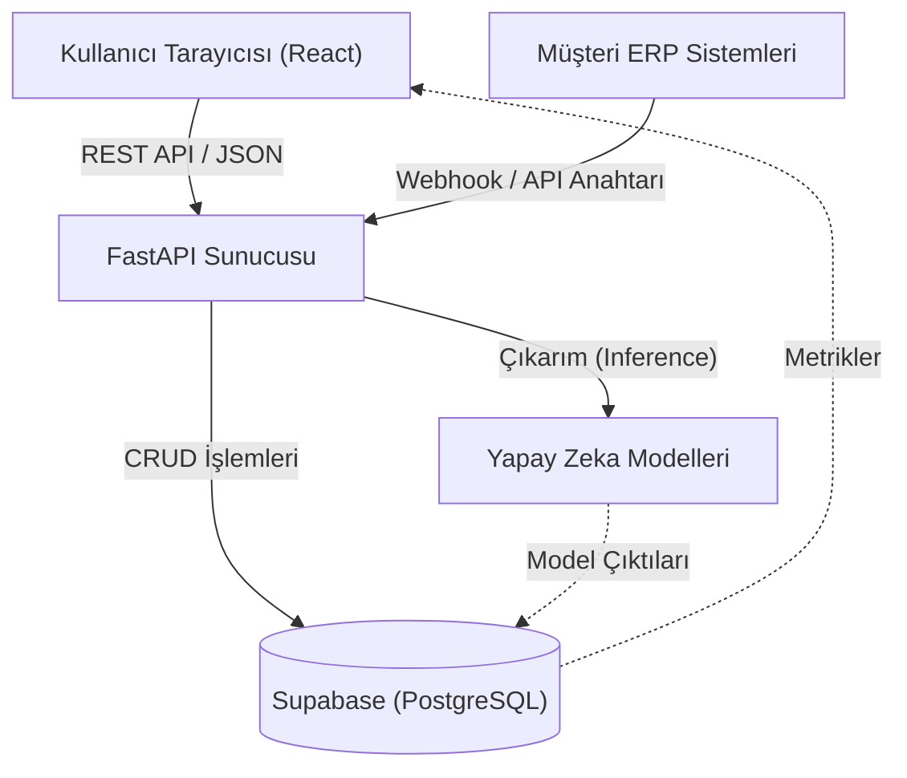

# Sistem Mimarisi ve Veri Akışı

Cognitive Logix, modern SaaS uygulamaları için tasarlanmış, yüksek performanslı ve dağıtık bir mimari üzerine inşa edilmiştir.

## Genel Mimari (High-Level Architecture)

Sistem üç ana katmandan (layer) oluşur:

1. **Frontend (Kullanıcı Arayüzü):** React 18 ve Vite kullanılarak geliştirilmiş, son derece hızlı ve durum yönetimi (state management) optimize edilmiş bir SPA (Single Page Application).
2. **Backend (API ve İş Mantığı):** Python tabanlı FastAPI kullanılarak geliştirilmiş, asenkron ve yüksek eşzamanlılığa (concurrency) dayanıklı mikroservis tarzı mimari.
3. **Veritabanı ve Makine Öğrenmesi (Veri Katmanı):** Supabase (PostgreSQL) üzerinde koşan RLS (Row Level Security) korumalı veri ambarı ve CatBoost/LightGBM tabanlı tahminsel analitik modelleri.

## Güvenlik ve Çoklu Kiracı (Multi-Tenancy) Mimarisi

Cognitive Logix, bir B2B platformu olduğu için şirketlerin (tenant) verilerinin birbirinden tamamen izole olması en kritik unsurdur.

- **Satır Bazlı Güvenlik (Row Level Security - RLS):** Veritabanındaki her bir tablo (`ingested_records`, `usage_logs` vb.) Postgres düzeyinde RLS politikaları ile korunur. Bir şirket sadece kendi `tenant_id`'sine sahip satırları okuyabilir ve yazabilir.
- **Middleware İzolasyonu:** FastAPI tarafında bulunan `TenantUsageMiddleware`, her isteği (request) yakalar. JWT token'dan veya gönderilen `x-api-key` başlığından (header) şirketin benzersiz `tenant_id`'sini çıkartır ve bunu tüm yaşam döngüsü (request lifecycle) boyunca saklar.

## Veri Alımı (Ingestion) Boru Hattı

Müşteriler iki yolla veri gönderebilir:
1. **Manuel CSV Yüklemesi:** Kullanıcı arayüzünden yüklenen CSV dosyaları, `pandas` yardımıyla bellekte işlenir. Kullanıcı kolon eşleştirmelerini yaptıktan sonra veriler Supabase'e kalıcı olarak (persist) kaydedilir.
2. **ERP Webhook'ları:** Sistem, dışarıdan gelen JSON verilerini `/api/v1/ingest/webhook` uç noktası (endpoint) üzerinden kabul eder. Gelen verilerdeki kolon isimleri (örneğin "tutar" veya "musteri_ulkesi"), **NLP Auto-Mapping** algoritması sayesinde otomatik olarak sistemin anladığı standart değişkenlere (`Sales`, `Origin` vb.) dönüştürülür.

### Yapay Zeka Besleme Raporu (Model Feed Report)
Her veri alımında sistem dinamik bir rapor üretir. Gelen verilerin *Lojistik, Finansal Risk* ve *Talep Tahmini* modellerini çalıştırmak için yeterli olup olmadığını kontrol eder. Gerekli tüm sütunlar (kolonlar) mevcutsa, o modülün durumu "Hazır" (Ready) olarak işaretlenir.

## Önbellekleme (Caching) ve Performans
Kontrol Kulesi'ndeki (Control Tower) gösterge panelleri sıfır gecikmeli çalışmak zorundadır. Bu nedenle, veritabanından çekilen büyük veri setleri sunucu tarafında (backend) önbelleğe (cache) alınır. Her yeni veri alımında (webhook veya CSV), o şirkete ait önbellek otomatik olarak geçersiz kılınır (invalidate) ve en taze verilerle arka planda tekrar hesaplanır.
